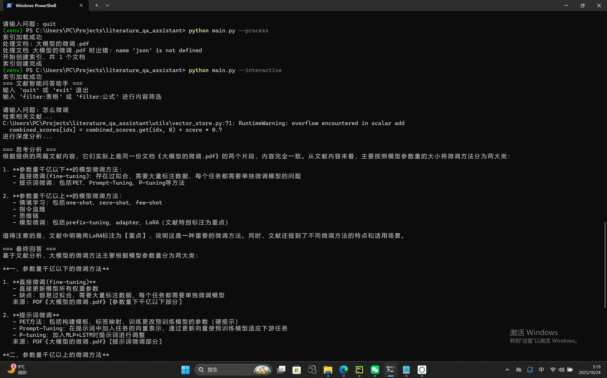

# 文献文档智能问答助手 📚🤖

一个基于多格式文献读取和深度分析的智能问答系统，专为科研人员和学生设计，帮助您高效获取和理解文献信息。

## 🌟 核心功能

### 📁 全格式文献支持
- **文本格式**: TXT、MD、TEX
- **Office文档**: DOCX、PPTX、XLSX
- **学术文献**: PDF、CAJ（有限支持）、ENW、RIS
- **图像文件**: JPG、PNG（OCR文字识别）

### 🔍 智能检索系统
- **混合检索策略**: BM25关键词检索 + FAISS向量相似度检索
- **内容筛选**: 支持按"含表格"、"含公式"等格式类型筛选
- **智能缓存**: 避免重复处理和计算，提升响应速度

### 🤖 深度分析能力
- **专业解读**: 调用DeepSeek API进行逻辑分析和观点整合
- **来源追溯**: 明确标注引用文献的格式、标题和具体位置
- **多文献关联**: 自动关联不同文献中的相关观点和数据

## 🛠️ 技术架构

### 核心技术栈
- **Python 3.8+** - 后端编程语言
- **Sentence Transformers** - 文本向量化（all-MiniLM-L6-v2）
- **FAISS** - 向量相似度检索
- **BM25** - 关键词检索算法
- **DeepSeek API** - 深度分析和内容生成

### 数据处理流程
####文献读取 → 文本提取 → 格式标准化 → 向量化 → 混合检索 → 深度分析 → 答案生成


## 📥 安装指南

### 环境要求
- Python 3.8 或更高版本
- 至少 4GB 可用内存
- 网络连接（用于API调用和模型下载）

### 快速安装

1. **克隆项目**
```bash
git clone https://github.com/7121JV/literature_qa_assistant.git
cd literature_qa_assistant
```
2.**创建虚拟环境**
```bash
# 使用conda
conda create -n literature_qa python=3.8
conda activate literature_qa

# 或使用venv
python -m venv venv
# Windows
venv\Scripts\activate
# Linux/Mac
source venv/bin/activate
```
3**安装依赖**
```bash
pip install -r requirements.txt
```
4.**配置环境变量**
编辑 .env 文件，设置您的 DeepSeek API 密钥：
```bash
DEEPSEEK_API_KEY=your_actual_deepseek_api_key_here
DEEPSEEK_BASE_URL=https://api.deepseek.com/v1
```
##🚀 使用方法
###准备文献数据
将您的文献文档放入 data/raw/ 目录，支持以下格式：
```bash
data/raw/
├── 论文.pdf
├── 报告.docx
├── 数据.xlsx
├── 参考文献.enw
└── 图片资料.png
```
###基本操作流程
###处理文献并创建索引

```bash
python main.py --process
```
###交互式问答模式

```bash
python main.py --interactive
```
###直接提问

```bash
python main.py --question "机器学习在医疗领域有哪些应用？"
```
###使用内容筛选

```bash
python main.py --question "文献中的实验数据" --filter 表格
```
## 交互模式命令

在交互模式中，您可以使用以下命令：

- `filter:表格`  — 只检索包含表格的内容
- `filter:公式`  — 只检索包含公式的内容
- `filter:全部`  — 取消筛选（显示所有内容）
- `quit` 或 `exit`  — 退出程序


### ✅ 完全支持的格式

| 格式     | 说明         | 特性             |
|----------|--------------|------------------|
| PDF      | 学术论文、报告 | 支持扫描件OCR识别 |
| DOCX     | Word文档     | 保留段落结构      |
| TXT      | 纯文本       | 基础文本处理      |
| MD       | Markdown     | 解析标记语法      |
| XLSX     | Excel表格    | 表格数据提取      |
| JPG/PNG  | 图片文献     | OCR文字识别       |
| ENW/RIS  | 参考文献     | 结构化字段提取    |
| TEX      | LaTeX文档    | 公式识别          |

---

### ⚠️ 有限支持的格式

| 格式     | 说明            | 限制                |
|----------|-----------------|---------------------|
| CAJ      | 中国知网格式    | 需要额外工具支持    |
| PPTX     | PowerPoint      | 基础文本提取        |

## CAJ文件特别说明

如需处理CAJ文件，请执行以下额外步骤：

```bash
# 安装caj2pdf-restructured
pip install caj2pdf-restructured

# 安装系统依赖 (Ubuntu/Debian)
sudo apt install mupdf-tools

# 或使用官方CAJViewer转换为PDF

```

## 🎯 使用示例

### 示例1：基础文献问答

```text
用户：机器学习的主要算法有哪些？

系统回复：
=== 思考分析 ===
根据检索到的文献内容，机器学习算法可分为监督学习、无监督学习和强化学习三大类…

=== 最终回答 ===
机器学习主要算法包括：
1. 监督学习算法：线性回归、逻辑回归、决策树等（来源：PDF《机器学习综述》2.1节）
2. 无监督学习算法：K均值聚类、主成分分析等（来源：DOCX《无监督学习研究》3.2节）
3. 强化学习算法：Q-learning、策略梯度等（来源：PDF《强化学习进展》4.1节表格1）
```

### 示例2：数据查询

```text
用户：文献中关于深度神经网络准确率的实验数据

系统回复：
=== 思考分析 ===
检索到3篇文献包含深度神经网络准确率数据，其中文献A在ImageNet数据集上达到95.2%...

=== 最终回答 ===
深度神经网络在各数据集上的准确率表现：
- ResNet-50在ImageNet上达到95.2%（来源：PDF《深度视觉识别》3.2节表格2）
- BERT在GLUE基准上达到92.8%（来源：PDF《自然语言处理进展》4.3节）
- Transformer在机器翻译上达到89.5%（来源：DOCX《神经机器翻译》2.4节表格1）
```
##使用截图
处理文献文件和咨询



